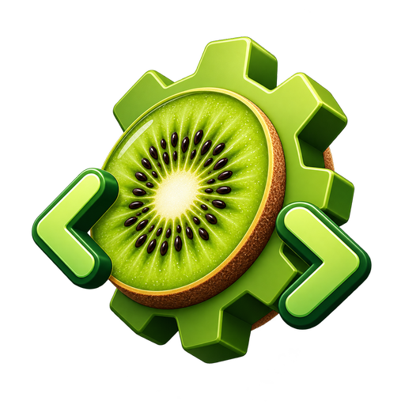

<p align="center">
  
</p>
<h1 align="center">Kiwii</h1>
<p align="center">Coding agent cho terminal và trình duyệt, chạy hoàn toàn trên máy của bạn.<br/>A local-first coding agent for your terminal and browser.</p>
<p align="center">
  <a href="https://github.com/dannyluutpt/Code-Harness/actions/workflows/ci.yml"></a>
  <a href="LICENSE"></a>
</p>

---

## 🇻🇳 Tiếng Việt

Kiwii là một harness cho AI coding agent, tương đương Claude Code hay Codex CLI về tính năng. Kiwii không gọi về bất kỳ máy chủ nào ngoài nhà cung cấp mô hình bạn chọn.

### Tính năng

| | |
|---|---|
| Giao diện | TUI trong terminal (`kiwii`) và Web UI localhost (`kiwii web`) |
| Chạy không tương tác | `kiwii run "..."`, `--format json`, `--continue`, `--session`, dùng được trong script và CI |
| Provider | Anthropic, OpenAI (API key hoặc ChatGPT Plus/Pro), Google Gemini, OpenRouter, Ollama (tự phát hiện), mọi endpoint OpenAI-compatible, và hơn 150 provider khác từ models.dev |
| Permission mode | `default`, `acceptEdits`, `plan`, `auto`, `bypassPermissions` giống Claude Code, đổi bằng `Shift+Tab`; kèm allow/deny list `Bash(git *)`, `Edit(src/**)` |
| Hooks | Chạy lệnh shell tại `PreToolUse`, `PostToolUse`, `UserPromptSubmit`, `Stop`, `SessionStart`, `SessionEnd`, `PreCompact`, `PermissionRequest`, `Notification` |
| Ngữ cảnh | `KIWII.md` (đọc cả `AGENTS.md`, `CLAUDE.md`), bộ nhớ dài hạn tự động theo dự án, tự nén ngữ cảnh, tiếp tục phiên |
| Mở rộng | MCP client (stdio/HTTP, OAuth), skills `SKILL.md` (đọc cả `~/.claude/skills`), slash command bằng Markdown, agent con tuỳ chỉnh, plugin |
| Tương thích Claude Code | Mở Kiwii trong dự án cũ là dùng ngay: `CLAUDE.md`, `.claude/settings.json` (permissions, hooks, env), `.claude/commands`, `.claude/agents`, `.claude/skills`; cùng tên lệnh slash (`/clear`, `/model`, `/mcp`, `/login`, `/rewind`, `/resume`, `/permissions`, `/memory`), cờ `-p`/`-c`/`-r`, `Shift+Tab` đổi mode, `# ghi chú` lưu bộ nhớ |
| Tools | read/write/edit/bash/glob/grep, websearch (Exa không cần key, Tavily/Brave/Parallel), webfetch, LSP, ảnh, todo, `/commit`, `/pr`, `/review`, `/init` |

### Cài đặt

macOS, Linux, WSL:

```sh
curl -fsSL https://raw.githubusercontent.com/dannyluutpt/Code-Harness/main/install | bash
```

Windows (PowerShell):

```powershell
irm https://raw.githubusercontent.com/dannyluutpt/Code-Harness/main/install.ps1 | iex
```

Hoặc tải binary cho hệ điều hành của bạn ở trang [Releases](https://github.com/dannyluutpt/Code-Harness/releases) và đặt vào `PATH`.

### Bắt đầu

```sh
export ANTHROPIC_API_KEY=sk-...   # hoặc: kiwii auth login
cd du-an-cua-ban
kiwii                              # mở TUI
kiwii run "giải thích cấu trúc repo này"
kiwii web                          # mở Web UI tại localhost
```

Gõ `/init` trong phiên đầu tiên để Kiwii tạo `KIWII.md` cho dự án. Tài liệu chi tiết trong thư mục [`docs/`](docs/).

### Cấu hình nhanh

`kiwii.json` trong thư mục dự án (hoặc `~/.config/kiwii/kiwii.json`):

```jsonc
{
  "$schema": "https://raw.githubusercontent.com/dannyluutpt/Code-Harness/main/schema/config.json",
  "model": "anthropic/claude-sonnet-5",
  "permission_mode": "acceptEdits",
  "permissions": { "allow": ["Bash(bun *)"], "deny": ["Read(.env)"] },
  "hooks": { "PreToolUse": [{ "matcher": "bash", "hooks": [{ "type": "command", "command": "./scripts/guard.sh" }] }] },
  "mcp": { "github": { "type": "remote", "url": "https://api.githubcopilot.com/mcp/" } }
}
```

### Phát triển

```sh
bun install
bun typecheck
bun run --cwd packages/kiwii build -- --single   # binary trong packages/kiwii/dist
bun dev                                          # chạy từ mã nguồn
```

---

## 🇬🇧 English

Kiwii is a coding-agent harness on par with Claude Code and Codex CLI. It only talks to the model provider you configure.

### Features

| | |
|---|---|
| Interfaces | Terminal TUI (`kiwii`) and a localhost web UI (`kiwii web`) |
| Headless | `kiwii run "..."`, `--format json`, `--continue`, `--session` for scripts and CI |
| Providers | Anthropic, OpenAI (API key or ChatGPT Plus/Pro login), Google Gemini, OpenRouter, Ollama (auto-detected), any OpenAI-compatible endpoint, and 150+ providers from models.dev |
| Permission modes | `default`, `acceptEdits`, `plan`, `auto`, `bypassPermissions` like Claude Code, cycled with `Shift+Tab`; plus allow/deny lists such as `Bash(git *)`, `Edit(src/**)` |
| Hooks | Shell commands on `PreToolUse`, `PostToolUse`, `UserPromptSubmit`, `Stop`, `SessionStart`, `SessionEnd`, `PreCompact`, `PermissionRequest`, `Notification` |
| Context | `KIWII.md` (also reads `AGENTS.md` and `CLAUDE.md`), automatic per-project long-term memory, auto-compaction, session resume |
| Extensibility | MCP client (stdio/HTTP with OAuth), `SKILL.md` skills (including `~/.claude/skills`), Markdown slash commands, custom subagents, plugins |
| Claude Code compatible | Open Kiwii in an existing project and it just works: `CLAUDE.md`, `.claude/settings.json` (permissions, hooks, env), `.claude/commands`, `.claude/agents`, `.claude/skills`; same slash names (`/clear`, `/model`, `/mcp`, `/login`, `/rewind`, `/resume`, `/permissions`, `/memory`), `-p`/`-c`/`-r` flags, `Shift+Tab` mode cycling, `# note` memory |
| Tools | read/write/edit/bash/glob/grep, web search (Exa needs no key; Tavily/Brave/Parallel), web fetch, LSP, images, todos, `/commit`, `/pr`, `/review`, `/init` |

### Install

macOS, Linux, WSL:

```sh
curl -fsSL https://raw.githubusercontent.com/dannyluutpt/Code-Harness/main/install | bash
```

Windows (PowerShell):

```powershell
irm https://raw.githubusercontent.com/dannyluutpt/Code-Harness/main/install.ps1 | iex
```

Or grab a binary from the [Releases](https://github.com/dannyluutpt/Code-Harness/releases) page and put it on your `PATH`.

### Quick start

```sh
export ANTHROPIC_API_KEY=sk-...   # or: kiwii auth login
cd your-project
kiwii                              # TUI
kiwii run "explain how this repo is structured"
kiwii web                          # localhost web UI
```

Run `/init` in your first session to generate a `KIWII.md`. Full documentation lives in [`docs/`](docs/).

### Configuration at a glance

`kiwii.json` in the project (or `~/.config/kiwii/kiwii.json`); see the snippet in the Vietnamese section above and [`docs/config.md`](docs/config.md).

### Development

```sh
bun install
bun typecheck
bun run --cwd packages/kiwii build -- --single   # binary in packages/kiwii/dist
bun dev                                          # run from source
```

## License

MIT, see `LICENSE`.
